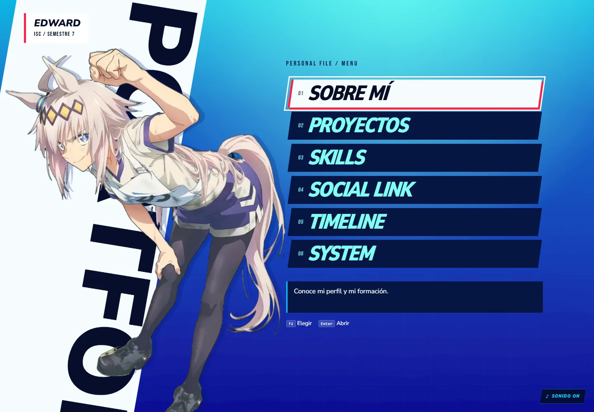
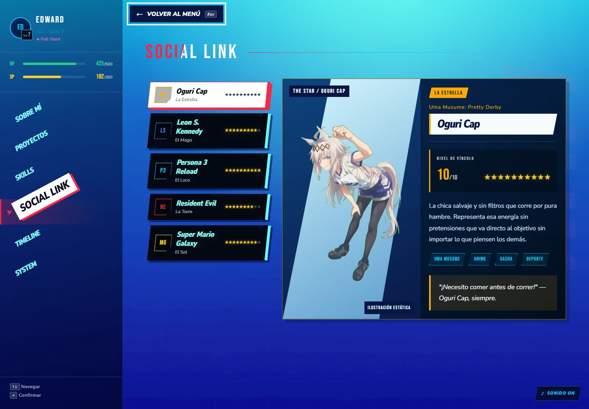

# P3R Portfolio — Edward Negrete

Portafolio personal inspirado en el menú de **Persona 3 Reload**. Proyecto de aprendizaje construido con Next.js 16, React 19, TypeScript y Tailwind CSS 4, con diseño personalizado en CSS.

## Capturas

Capturas reales de la versión local a 1440 × 1000, tomadas el 28/09/2026 con movimiento reducido. La ficha de Proyectos utiliza estas mismas imágenes en su portada y en el detalle.

Galería verificada en Brave headless a 1440 y 390 px: carga de portada y capturas, scroll del diálogo, ausencia de desbordamiento horizontal y cierre con Escape restaurando el foco en «Ver detalle». Lint y build completados.





## Desarrollo local

Requiere Node.js 20.9 o superior y npm.

```sh
npm ci
npm run dev
```

Abre la URL indicada en la terminal (normalmente http://localhost:3000).

Durante el diseño usa `npm run dev`: actualiza los cambios automáticamente. `npm start` sirve la compilación de producción y debe reiniciarse después de una nueva compilación.

```sh
npm run lint   # ESLint
npm run build  # Compilación y validación de TypeScript
npm test       # Pruebas de transiciones (Node.js 22.18+ o 24+)
npm start     # Servir la compilación de producción
```

## Pruebas de navegador

Las pruebas E2E usan Playwright contra una compilación de producción. El comando compila y abre su propio servidor en el puerto **3100**, sin reutilizar el servidor de desarrollo de 3000.

```sh
npx playwright install chromium
npm run test:e2e
```

Se prueban viewports de 1280 × 800, 768 × 1024 y 390 × 844. Cobertura:

- Entrada desde el splash, selección con Home/End, seis secciones y regreso con foco restaurado.
- Límites horizontales del contenido en los tres tamaños.
- Galería del proyecto, scroll, cierre con Escape y foco de vuelta al botón.
- Menú compacto: apertura, Escape y selección de sección.
- Silencio persistente tras recargar y splash una sola vez por sesión.
- Movimiento reducido sin solicitud del video de Oguri.
- Video: reproducción, pausa real, reanudación, repetición y retirada al seleccionar a Leon.

Si ya tienes un navegador Chromium instalado, puedes indicar su ejecutable. Ejemplo en PowerShell:

```powershell
$env:PLAYWRIGHT_EXECUTABLE_PATH = 'C:\Program Files\BraveSoftware\Brave-Browser\Application\brave.exe'
npm run test:e2e
```

Los fallos guardan capturas y trazas en `test-results/` (excluido de Git). Para inspeccionar una traza: `npx playwright show-trace <ruta-al-trace.zip>`. En equipos con recursos limitados, usa `npm run test:e2e -- --workers 1`.

Verificación del 29/09/2026 en Brave local: 14 casos aplicables aprobados entre la ejecución inicial y la repetición de dos recorridos que excedieron el límite inicial; un caso de menú compacto se omite en escritorio. El recorrido de seis secciones dispone de 90 segundos. La descarga del Chromium de Playwright falló por timeout, por eso esta ejecución utilizó Brave. Quedan pendientes otros motores, dispositivos físicos, medición de rendimiento y revisión estética completa.

## Revisión de dependencias — 04/10/2026

- Next.js y `eslint-config-next` actualizados de 16.2.7 a **16.3.8**; dependencias transitivas corregidas mediante `npm audit fix`, sin `--force`.
- Auditoría inicial: 13 entradas vulnerables (una crítica, once altas y una moderada).
- `npm audit --omit=dev`: **0 vulnerabilidades conocidas** en las dependencias de producción según la auditoría de esta fecha.
- `npm audit`: quedan **5 entradas altas** en una misma cadena de desarrollo: `eslint-config-next` → `@next/eslint-plugin-next` → `fast-glob` → `micromatch` → `braces`. La solución automática propone retroceder a `eslint-config-next@14.2.35`; se mantiene la versión alineada con Next 16 y queda pendiente una corrección compatible de esa cadena.
- Verificación posterior: lint, compilación de producción, seis pruebas unitarias y 14 casos E2E aprobados en Brave con un worker. Un caso de menú compacto se omite en escritorio. Esta ejecución completa reemplaza los resultados parciales del 29/09 para la versión actual.
- Pendientes de esta fase: medición de rendimiento, otros motores de navegador y comprobación en dispositivos físicos.

## Rendimiento y otros navegadores

Optimización del 06/10/2026: se eliminó la precarga global de sonidos. La transferencia inicial bajó de 441 a 364 KiB (aproximadamente 17.6 %); ya no se solicitan MP3 antes de usarlos. En tres mediciones móviles por versión, la mediana de Lighthouse pasó de 78 a 84, con variación entre ejecuciones. Las pruebas de red y silencio pasaron en Chromium de escritorio/móvil y Firefox. La primera reproducción puede necesitar esperar la descarga del efecto; después se reutiliza su elemento de audio.

La [línea base de rendimiento y compatibilidad](docs/performance.md) registra las mediciones, limitaciones y comandos. Lighthouse local: 74/100 móvil simulado y 96/100 escritorio en la entrada con splash, 441 KiB transferidos. Firefox pasó los cuatro casos aplicables y conservó la transparencia del video. WebKit está bloqueado por bibliotecas faltantes del entorno Windows; Safari y dispositivos físicos siguen pendientes.

## Organización

Las seis fichas se cargan mediante `next/dynamic` al abrirlas, con un mensaje accesible durante la espera. La medición local encontró unos 11 KB menos de recursos iniciales; el detalle y las limitaciones están en `docs/performance.md`.

- `app/page.tsx`: composición de la interfaz y estado de navegación.
- `components/MainMenu.tsx`: pantalla principal con Oguri, selección por flechas/Home/End y apertura de las seis secciones. Volver restaura el foco en la última sección elegida.
- `app/layout.tsx`: fuentes, idioma y metadatos.
- `app/data/site.ts`: título, descripción y URL base del sitio.
- `app/opengraph-image.tsx`: tarjeta PNG para compartir (1200 × 630), generada desde el perfil.
- `app/icon.svg` y `app/favicon.ico`: identidad ED en formato vectorial y favicon compatible.
- `app/data/profile.ts`: perfil, avance académico y estadísticas decorativas.
- `app/data/portfolio.ts`: habilidades, intereses y trayectoria.
- `app/data/projects.ts`: proyectos reales, tecnologías, enlaces y capturas tipadas; los filtros se generan desde estos datos.
- `app/data/systemActions.ts`: acciones de contacto y estado de cada recurso (disponible o pendiente).
- `components/Sidebar.tsx`: navegación por clic, teclado y menú móvil.
- `components/SectionTransition.tsx`: transición entre secciones basada en eventos CSS.
- `components/ProgressBar.tsx`: barras reutilizables con valores accesibles y animación CSS.
- `components/ProjectDialog.tsx`: detalle de proyecto con diálogo nativo, Escape y restauración de foco.
- `components/SoundControls.tsx`: silencio persistente y detención del audio al ocultar la pestaña; los efectos se cargan al utilizarlos por primera vez.
- `components/SplashScreen.tsx`: bienvenida modal nativa una vez por sesión, con botón de entrada y foco dirigido al menú al terminar.
- `components/CustomCursor.tsx`: cursor propio (anillo con retardo + punto) activo solo con puntero fino; el nativo queda oculto en `app/globals.css`.
- `components/OguriPortrait.tsx`: ilustración animada exclusiva de la ficha de Oguri en Social Link, con pausa, detección de visibilidad y movimiento reducido.
- `public/img/`: imágenes del sitio (ilustración de Oguri Cap).
- `lib/sounds.ts`: efectos de sonido tipados, estado de silencio persistente y reproducción tolerante a fallos.
- `public/audio/`: efectos de interfaz extraídos de Persona 3 Reload (CueSheet) y convertidos a MP3.
- `components/sections/`: componentes de cada pantalla.
- `app/globals.css`: estilos organizados en capas, responsive y movimiento reducido.

El progreso académico se calcula desde los **semestres completados**, no desde el semestre en curso. Las habilidades de About y Skills comparten sus valores. HP/SP son elementos decorativos y los niveles de habilidades representan una autoevaluación personal.

## Controles

- Menú principal: clic/toque o Enter/Espacio para abrir una sección; flechas, Home y End para elegir.
- Dentro de una sección: «Volver al menú» o Escape para regresar. Un diálogo abierto o el menú móvil desplegado atienden Escape primero.

- Pantalla de inicio: activar «Entrar al portafolio» con clic, toque, Enter o Espacio; Escape también permite continuar. Tab mantiene el foco dentro del diálogo. Se muestra una vez por sesión de pestaña.
- Tab: acceder a los controles.
- «Saltar al contenido»: primer enlace al navegar con Tab, permite omitir el menú lateral.
- Flechas arriba/abajo dentro del menú: recorrer opciones.
- Enter o Espacio: confirmar.
- Home / End: primera o última opción.
- En móvil: botón MENÚ para desplegar; Escape o seleccionar una opción para cerrar.
- Botón SONIDO (esquina inferior derecha): silencia o reactiva los efectos; el estado se guarda en el navegador.
- En escritorio, el cursor del sistema se sustituye por uno propio que se agranda sobre elementos interactivos.

## Flujo de trabajo

1. Revisar `git status` y definir una etapa de alcance concreto.
2. Editar los datos en sus módulos compartidos; evitar duplicarlos en componentes.
3. Mantener los tipos de TypeScript y usar elementos HTML accesibles.
4. Ejecutar `npm run lint`, `npm run build` y `git diff --check`.
5. Comprobar navegación, cambios rápidos de sección, scroll y menú a 390, 768 y 1280 px; revisar también movimiento reducido.
6. Revisar el diff y crear un commit descriptivo por etapa (`feat:`, `fix:`, `refactor:` o `docs:`), antes de enviarlo al remoto.

## Preparación del despliegue

- Define `SITE_URL` con la dirección pública completa (por ejemplo, `https://tu-dominio.example`) antes de compilar para producción. Consulta `.env.example`.
- Si no se define, se utiliza `VERCEL_PROJECT_PRODUCTION_URL` en Vercel y `http://localhost:3000` en local.
- Al cambiar el dominio, vuelve a compilar: los metadatos se generan estáticamente.
- Revisa `/opengraph-image`, `/icon.svg` y `/favicon.ico`. Los metadatos incluyen URL canónica, Open Graph y tarjeta grande para Twitter/X.
- La vista previa real en redes se comprobará con una URL pública; localhost solo permite revisar los archivos y etiquetas.

## Estado

### Alcance de la primera publicación

- System ofrece correo institucional y GitHub. Por decisión de Edward, CV y LinkedIn quedan fuera del proyecto, sin avisos de recursos pendientes.
- Proyectos conserva únicamente P3R Portfolio, el repositorio existente de este sitio. No se requieren proyectos adicionales para publicar.
- Las imágenes de los otros Social Links están aplazadas y no bloquean el despliegue.
- Antes de publicar: medir rendimiento, revisar dependencias y compatibilidad del video en otros motores, y confirmar los textos de perfil y Timeline.
- Después: configurar alojamiento y URL pública, verificar enlaces y metadatos en producción.

### Interacción

El recorrido menú ↔ ficha utiliza `SceneTransition`: barrido diagonal de cobertura (220 ms), cambio de escena y revelado (300 ms), con entrada coordinada de ilustración/opciones o del panel. Durante el cambio el contenido queda inerte y el foco se restaura al terminar. Movimiento reducido omite el barrido. Un identificador por fase evita avances duplicados por eventos tardíos y temporizadores de respaldo. La máquina de estados tiene pruebas con `node:test`; el ritmo visual queda pendiente de revisión en navegador.

Después del splash se presenta un menú principal independiente con el personaje y las seis opciones. Las fichas conservan navegación lateral directa y un botón de regreso. En móvil las opciones se muestran sobre una ilustración atenuada. La entrada enfoca el botón de regreso; al volver se enfoca la última sección elegida. El recorrido y la restauración de foco están cubiertos por las pruebas Playwright en tres tamaños.

Las transiciones recuerdan el último destino solicitado y cuentan con un temporizador de respaldo si se cancela la animación. El audio se detiene al ocultar la pestaña, limita repeticiones de cursor a intervalos de 70 ms y limpia el sonido diferido de About al desmontar la sección. Comprobaciones aisladas con audio simulado: limitación de repeticiones, silencio, pestaña oculta y detención correctas; la revisión interactiva de navegación rápida y foco sigue pendiente en navegador.

El splash bloquea el contenido de fondo mediante `showModal()` y mantiene ese bloqueo durante su transición de salida. Al entrar, enfoca el menú móvil o la sección activa de escritorio; con movimiento reducido cierra sin esperar la animación. Escape reproduce cancelación únicamente al cerrar un menú móvil o diálogo de proyecto. Pendiente de comprobación interactiva en navegador: entrada, foco, recarga de sesión y cierre de proyectos.

### Dirección visual de referencia

About y System comparten `components/sections/ProfilePanel.module.css` para el panel oscuro y el encabezado blanco con acento rojo. Las estadísticas usan filas negras diagonales y etiquetas ampliadas; System ofrece correo y GitHub y muestra Tab como control para recorrer sus acciones. La revisión estética final sigue pendiente.

Fase 2, Proyectos y Timeline: títulos claros con cortes diagonales, selección blanca con acento rojo y paneles oscuros. Los filtros de proyectos conservan su estado visible al pasar el ratón; el diálogo comparte el tratamiento visual de las tarjetas. Timeline amplía fechas y subtítulos y alinea el eje con los marcadores. Los ajustes compactos se basan en el ancho del panel; el diálogo usa el ancho de ventana. Pendiente de revisión visual.

La composición interna de About, System, Social Link y Timeline responde al ancho del panel de contenido mediante consultas de contenedor (`portfolio`), descontando el menú lateral. La aprobación visual de esta fase sigue pendiente; lint y build no sustituyen la revisión en navegador.

La revisión de capturas de escritorio motivó una ficha oscura para mejorar el contraste de About y límites de desbordamiento horizontal en Social Link. Por decisión de diseño, se retiró la columna global de personaje: Oguri permanece en el menú principal y aparece dentro de su propia ficha en Social Link.

### Social Link: primera ficha ilustrada

**Versión actual — video elegido por Edward:** se utiliza `gemini_generated_video_2c36ce23.mp4` en sustitución de `Oguri_Idle.mp4`, convertido a `idle-video.webm` con transparencia VP9 (540 × 960, 24 fps, 10 s, 1.83 MB). Se eliminó la pista de audio y se conservó la duración completa, ya que este archivo comienza directamente con fondo verde. El póster correspondiente pesa 54 KB. El video reemplaza la secuencia de cinco imágenes descrita más abajo; esos recursos se conservan como antecedentes y ya no se solicitan en la ficha.

El video se carga al entrar en vista, se repite con `loop` y conserva Pausar/Reanudar. Se detiene fuera de vista y al ocultar la pestaña. Movimiento reducido muestra el póster sin iniciar la descarga del video. Los errores de reproducción conservan la imagen fija. La continuidad estética de la unión, los bordes del recorte y la compatibilidad de transparencia fuera de Chromium siguen pendientes de revisión; no se presenta como un bucle perfecto ni como una animación de 30/60 fps.

Verificación de esta integración en Brave headless: transparencia del fondo, avance real del video, pausa/reanudación, reinicio al finalizar, pausa fuera de vista, movimiento reducido y ausencia de desbordamiento a 1440 y 390 px. El menú principal conserva su ilustración original.

#### Antecedente: sprite de cinco fotogramas

La ficha de Oguri utiliza los cinco fotogramas proporcionados por Edward. Se conserva un maestro WebP sin pérdida de 5155 × 1526 (aproximadamente 3.85 MB), pero la animación descarga una variante de 401 KB o 1.13 MB según el ancho mostrado y la densidad de pantalla: reducciones aproximadas del 90 % y 71 % respecto al maestro. Las variantes usan WebP calidad 90, alfa 100 y redimensionado por fotograma; mantienen el encuadre y el bucle de ida y vuelta de 3.2 segundos. El póster original pesa aproximadamente 746 KB. La secuencia solo se solicita cuando la ficha entra en pantalla y no está activo el movimiento reducido. El póster permanece visible hasta que el sprite termina de decodificarse; ante un error se conserva la imagen fija o la variante previamente cargada. Al ampliar el panel se puede subir de resolución sin sustituir la imagen antes de decodificarla.

La animación se pausa con su botón, al salir de vista o al ocultar la pestaña. Movimiento reducido muestra el póster y elimina el barrido de entrada. En paneles amplios, ilustración y texto comparten dos columnas; en tamaños menores se apilan. Los otros vínculos conservan sus fichas de texto hasta disponer de sus recursos. Revisar visualmente el bucle, sus bordes y la composición móvil antes de extender el patrón.

Verificado en Brave headless local: secuencia en reproducción, pausa que congela el tiempo, reanudación, pausa por intersección, imagen fija con movimiento reducido, ausencia de desbordamiento horizontal a 1440 × 1000 y 390 × 844, retirada de Oguri al seleccionar Leon o About y conservación de su imagen original en el menú principal. La aprobación estética del movimiento sigue pendiente del usuario.

Al cambiar de vínculo, `SceneTransition` en modo panel mantiene la ficha anterior durante la cobertura y revela la última selección solicitada. La lista sigue disponible durante el barrido, pero el detalle permanece inerte hasta finalizar. La misma máquina de estados se reutiliza para el menú principal y las fichas; sus pruebas incluyen selecciones rápidas de vínculos.

La optimización también se comprobó en Brave headless: selección inicial de 480, subida a 960 con mayor densidad y conservación de la variante decodificada al reducir la ventana. Lint y build pasaron. Estas comprobaciones funcionales no sustituyen la aprobación estética de las variantes comprimidas.

### Siguientes fases

| Fase | Estado y criterio de cierre |
| --- | --- |
| A — Primera ficha de Oguri | Encuadre del panel aprobado. Video proporcionado por Edward integrado como versión provisional, sin audio y con croma retirado. Pulido del bucle definitivo diferido; revisar esta integración en móvil y escritorio. |
| B — Completar Social Link | Imágenes de Leon, Persona 3 Reload, Resident Evil y Super Mario Galaxy aplazadas por Edward; se conservan las fichas de texto. |
| C — Contenido y pulido global | Capturas reales incorporadas. CV y LinkedIn retirados por decisión de Edward; único proyecto: este portafolio. Pendiente confirmar textos de Timeline y perfil y completar el pulido visual. |
| D — Validación integral | Pruebas Playwright incorporadas para navegación, foco, diálogos, menú móvil, silencio persistente y video/movimiento reducido en tres tamaños. Pendientes otros motores, dispositivos físicos y medición de rendimiento. |
| E — Publicación | Elegir alojamiento y URL, configurar `SITE_URL`, verificar enlaces y tarjetas sociales en producción y cerrar el README con capturas y enlace público. |

Se distingue entre implementación, verificación funcional y aprobación visual. Con el video provisional de Oguri podemos avanzar a los recursos de los otros vínculos y al contenido profesional sin esperar nuevas generaciones.

La nueva iteración toma como referencia los menús principal, Social Link y estado del grupo de Persona 3 Reload: fondo azul eléctrico con luz cian superior, selección blanca con acento rojo y filas negras de corte diagonal. Aplicado al fondo, navegación, Social Link y Skills. La revisión visual a 390, 768 y 1280 px sigue pendiente de comprobación en navegador.

El cursor personalizado se activa al mover el ratón; conserva el cursor nativo en diálogos y con movimiento reducido. Silenciar detiene también los efectos que ya se están reproduciendo.

Las seis secciones cuentan con presentación: About, Proyectos, Skills, Social Link, Timeline y System, con navegación por teclado en las listas y estilos aislados en CSS Modules. Proyectos muestra únicamente este portafolio con filtros, capturas y detalle enlazado a GitHub. Skills presenta Java, SQL/Bases de datos, HTML/CSS y JavaScript con porcentajes de autoevaluación y comparte esos datos con About y System. La interfaz reproduce efectos de sonido de Persona 3 Reload en menús, selecciones y cierres, con botón de silencio persistente; los navegadores solo permiten audio tras la primera interacción del usuario. La pantalla de inicio se muestra una vez por pestaña y anuncia la entrada con el sonido de apertura del menú, y en escritorio el cursor del sistema se sustituye por uno propio. Oguri aparece en el menú principal y exclusivamente en su ficha dentro de Social Link. System conserva únicamente correo y GitHub.

La inspiración visual en Persona 3 Reload es un homenaje personal; este proyecto no está afiliado a Atlus.
